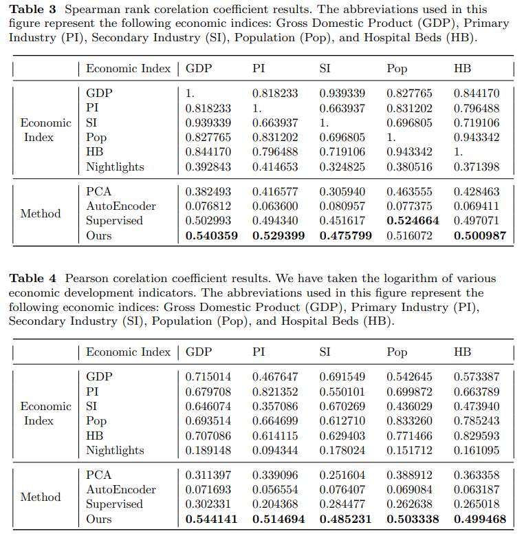

# Weakly Supervised Deep Learning for Fine-grained Socioeconomic Development

This repository contains the code for paper *Weakly Supervised Deep Learning for Fine-grained Socioeconomic Development*.

## Prerequisites

- Python 3.6 or higher
- PyTorch 1.7.0 or higher
- NumPy
- pandas
- scikit-learn
- timm
- geoio

## Installation

1. Clone this repository to your local machine:

```bash
git clone https://github.com/998822/Economic-Development
.git
cd Economic-Development
```

2. Install the required packages:

```bash
pip install -r requirements.txt
```

## Data Preparation

1. Place your satellite images in the `data_path` directory. The images should be in PNG format.

2. Prepare the proxy nightlights data by placing the corresponding GeoTIFF files in the `proxy_path` directory.

## Usage

1. Run the clustering model:

```bash
python main.py --data_path /path/to/satellite/images --proxy_path /path/to/nightlights/proxy --output_dir /path/to/save/checkpoints
```

2. The model will be fine-tuned on different nightlights categories and then used to perform clustering on the satellite images.

3. The trained model checkpoints will be saved in the `output_dir` directory.

## Results

The clustering results can be found in the `data` directory, where each subdirectory corresponds to a cluster.

## Correlation Coefficient Results in Paper



## License

This project is licensed under the MIT License.
